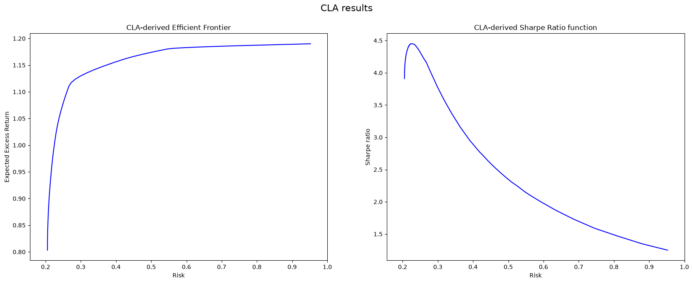

# CLA in Python 3

Original code in Python 2, together with the example dataset, is here: https://github.com/mdengler/cla

Based on the example by [adalseno](https://github.com/adalseno).

## Helper functions

## Import dataset

<table border="1" class="dataframe">
  <thead>
    <tr style="text-align: right;">
      <th></th>
      <th>X1</th>
      <th>X2</th>
      <th>X3</th>
      <th>X4</th>
      <th>X5</th>
      <th>X6</th>
      <th>X7</th>
      <th>X8</th>
      <th>X9</th>
      <th>X10</th>
    </tr>
  </thead>
  <tbody>
    <tr>
      <th>0</th>
      <td>1.175000</td>
      <td>1.190000</td>
      <td>0.396000</td>
      <td>1.120000</td>
      <td>0.346000</td>
      <td>0.679000</td>
      <td>0.089000</td>
      <td>0.730000</td>
      <td>0.481000</td>
      <td>1.080000</td>
    </tr>
    <tr>
      <th>1</th>
      <td>0.000000</td>
      <td>0.000000</td>
      <td>0.000000</td>
      <td>0.000000</td>
      <td>0.000000</td>
      <td>0.000000</td>
      <td>0.000000</td>
      <td>0.000000</td>
      <td>0.000000</td>
      <td>0.000000</td>
    </tr>
    <tr>
      <th>2</th>
      <td>1.000000</td>
      <td>1.000000</td>
      <td>1.000000</td>
      <td>1.000000</td>
      <td>1.000000</td>
      <td>1.000000</td>
      <td>1.000000</td>
      <td>1.000000</td>
      <td>1.000000</td>
      <td>1.000000</td>
    </tr>
    <tr>
      <th>3</th>
      <td>0.407552</td>
      <td>0.031758</td>
      <td>0.051839</td>
      <td>0.056639</td>
      <td>0.033023</td>
      <td>0.008278</td>
      <td>0.021659</td>
      <td>0.013324</td>
      <td>0.034348</td>
      <td>0.022499</td>
    </tr>
    <tr>
      <th>4</th>
      <td>0.031758</td>
      <td>0.906305</td>
      <td>0.031364</td>
      <td>0.026873</td>
      <td>0.019172</td>
      <td>0.009344</td>
      <td>0.024950</td>
      <td>0.007610</td>
      <td>0.028749</td>
      <td>0.013369</td>
    </tr>
    <tr>
      <th>5</th>
      <td>0.051839</td>
      <td>0.031364</td>
      <td>0.194909</td>
      <td>0.044085</td>
      <td>0.030068</td>
      <td>0.013227</td>
      <td>0.035260</td>
      <td>0.011549</td>
      <td>0.042756</td>
      <td>0.020573</td>
    </tr>
    <tr>
      <th>6</th>
      <td>0.056639</td>
      <td>0.026873</td>
      <td>0.044085</td>
      <td>0.195285</td>
      <td>0.027773</td>
      <td>0.005267</td>
      <td>0.013758</td>
      <td>0.007809</td>
      <td>0.029142</td>
      <td>0.016404</td>
    </tr>
    <tr>
      <th>7</th>
      <td>0.033023</td>
      <td>0.019172</td>
      <td>0.030068</td>
      <td>0.027773</td>
      <td>0.340591</td>
      <td>0.007771</td>
      <td>0.020678</td>
      <td>0.007364</td>
      <td>0.025427</td>
      <td>0.012841</td>
    </tr>
    <tr>
      <th>8</th>
      <td>0.008278</td>
      <td>0.009344</td>
      <td>0.013227</td>
      <td>0.005267</td>
      <td>0.007771</td>
      <td>0.159839</td>
      <td>0.021056</td>
      <td>0.005187</td>
      <td>0.017237</td>
      <td>0.007238</td>
    </tr>
    <tr>
      <th>9</th>
      <td>0.021659</td>
      <td>0.024950</td>
      <td>0.035260</td>
      <td>0.013758</td>
      <td>0.020678</td>
      <td>0.021056</td>
      <td>0.680567</td>
      <td>0.013779</td>
      <td>0.046270</td>
      <td>0.019261</td>
    </tr>
    <tr>
      <th>10</th>
      <td>0.013324</td>
      <td>0.007610</td>
      <td>0.011549</td>
      <td>0.007809</td>
      <td>0.007364</td>
      <td>0.005187</td>
      <td>0.013779</td>
      <td>0.955269</td>
      <td>0.010655</td>
      <td>0.007610</td>
    </tr>
    <tr>
      <th>11</th>
      <td>0.034348</td>
      <td>0.028749</td>
      <td>0.042756</td>
      <td>0.029142</td>
      <td>0.025427</td>
      <td>0.017237</td>
      <td>0.046270</td>
      <td>0.010655</td>
      <td>0.316816</td>
      <td>0.018543</td>
    </tr>
    <tr>
      <th>12</th>
      <td>0.022499</td>
      <td>0.013369</td>
      <td>0.020573</td>
      <td>0.016404</td>
      <td>0.012841</td>
      <td>0.007238</td>
      <td>0.019261</td>
      <td>0.007610</td>
      <td>0.018543</td>
      <td>0.110793</td>
    </tr>
  </tbody>
</table>

## Create variables

    ['X1', 'X2', 'X3', 'X4', 'X5', 'X6', 'X7', 'X8', 'X9', 'X10']

## Compute CLA

## Display results

<table id="T_21f4b">
  <thead>
    <tr>
      <th class="blank level0" >&nbsp;</th>
      <th id="T_21f4b_level0_col0" class="col_heading level0 col0" >Return</th>
      <th id="T_21f4b_level0_col1" class="col_heading level0 col1" >Risk</th>
      <th id="T_21f4b_level0_col2" class="col_heading level0 col2" >Lambda</th>
      <th id="T_21f4b_level0_col3" class="col_heading level0 col3" >X1</th>
      <th id="T_21f4b_level0_col4" class="col_heading level0 col4" >X2</th>
      <th id="T_21f4b_level0_col5" class="col_heading level0 col5" >X3</th>
      <th id="T_21f4b_level0_col6" class="col_heading level0 col6" >X4</th>
      <th id="T_21f4b_level0_col7" class="col_heading level0 col7" >X5</th>
      <th id="T_21f4b_level0_col8" class="col_heading level0 col8" >X6</th>
      <th id="T_21f4b_level0_col9" class="col_heading level0 col9" >X7</th>
      <th id="T_21f4b_level0_col10" class="col_heading level0 col10" >X8</th>
      <th id="T_21f4b_level0_col11" class="col_heading level0 col11" >X9</th>
      <th id="T_21f4b_level0_col12" class="col_heading level0 col12" >X10</th>
    </tr>
  </thead>
  <tbody>
    <tr>
      <th id="T_21f4b_level0_row0" class="row_heading level0 row0" >1</th>
      <td id="T_21f4b_row0_col0" class="data row0 col0" >1.190</td>
      <td id="T_21f4b_row0_col1" class="data row0 col1" >0.952</td>
      <td id="T_21f4b_row0_col2" class="data row0 col2" ></td>
      <td id="T_21f4b_row0_col3" class="data row0 col3" >0.000</td>
      <td id="T_21f4b_row0_col4" class="data row0 col4" >1.000</td>
      <td id="T_21f4b_row0_col5" class="data row0 col5" >0.000</td>
      <td id="T_21f4b_row0_col6" class="data row0 col6" >0.000</td>
      <td id="T_21f4b_row0_col7" class="data row0 col7" >0.000</td>
      <td id="T_21f4b_row0_col8" class="data row0 col8" >0.000</td>
      <td id="T_21f4b_row0_col9" class="data row0 col9" >0.000</td>
      <td id="T_21f4b_row0_col10" class="data row0 col10" >0.000</td>
      <td id="T_21f4b_row0_col11" class="data row0 col11" >0.000</td>
      <td id="T_21f4b_row0_col12" class="data row0 col12" >0.000</td>
    </tr>
    <tr>
      <th id="T_21f4b_level0_row1" class="row_heading level0 row1" >2</th>
      <td id="T_21f4b_row1_col0" class="data row1 col0" >1.190</td>
      <td id="T_21f4b_row1_col1" class="data row1 col1" >0.952</td>
      <td id="T_21f4b_row1_col2" class="data row1 col2" >58.303</td>
      <td id="T_21f4b_row1_col3" class="data row1 col3" >0.000</td>
      <td id="T_21f4b_row1_col4" class="data row1 col4" >1.000</td>
      <td id="T_21f4b_row1_col5" class="data row1 col5" >0.000</td>
      <td id="T_21f4b_row1_col6" class="data row1 col6" >0.000</td>
      <td id="T_21f4b_row1_col7" class="data row1 col7" >0.000</td>
      <td id="T_21f4b_row1_col8" class="data row1 col8" >0.000</td>
      <td id="T_21f4b_row1_col9" class="data row1 col9" >0.000</td>
      <td id="T_21f4b_row1_col10" class="data row1 col10" >0.000</td>
      <td id="T_21f4b_row1_col11" class="data row1 col11" >0.000</td>
      <td id="T_21f4b_row1_col12" class="data row1 col12" >0.000</td>
    </tr>
    <tr>
      <th id="T_21f4b_level0_row2" class="row_heading level0 row2" >3</th>
      <td id="T_21f4b_row2_col0" class="data row2 col0" >1.180</td>
      <td id="T_21f4b_row2_col1" class="data row2 col1" >0.546</td>
      <td id="T_21f4b_row2_col2" class="data row2 col2" >4.174</td>
      <td id="T_21f4b_row2_col3" class="data row2 col3" >0.649</td>
      <td id="T_21f4b_row2_col4" class="data row2 col4" >0.351</td>
      <td id="T_21f4b_row2_col5" class="data row2 col5" >0.000</td>
      <td id="T_21f4b_row2_col6" class="data row2 col6" >-0.000</td>
      <td id="T_21f4b_row2_col7" class="data row2 col7" >0.000</td>
      <td id="T_21f4b_row2_col8" class="data row2 col8" >0.000</td>
      <td id="T_21f4b_row2_col9" class="data row2 col9" >0.000</td>
      <td id="T_21f4b_row2_col10" class="data row2 col10" >0.000</td>
      <td id="T_21f4b_row2_col11" class="data row2 col11" >0.000</td>
      <td id="T_21f4b_row2_col12" class="data row2 col12" >0.000</td>
    </tr>
    <tr>
      <th id="T_21f4b_level0_row3" class="row_heading level0 row3" >4</th>
      <td id="T_21f4b_row3_col0" class="data row3 col0" >1.160</td>
      <td id="T_21f4b_row3_col1" class="data row3 col1" >0.417</td>
      <td id="T_21f4b_row3_col2" class="data row3 col2" >1.946</td>
      <td id="T_21f4b_row3_col3" class="data row3 col3" >0.434</td>
      <td id="T_21f4b_row3_col4" class="data row3 col4" >0.231</td>
      <td id="T_21f4b_row3_col5" class="data row3 col5" >0.000</td>
      <td id="T_21f4b_row3_col6" class="data row3 col6" >0.335</td>
      <td id="T_21f4b_row3_col7" class="data row3 col7" >0.000</td>
      <td id="T_21f4b_row3_col8" class="data row3 col8" >0.000</td>
      <td id="T_21f4b_row3_col9" class="data row3 col9" >0.000</td>
      <td id="T_21f4b_row3_col10" class="data row3 col10" >0.000</td>
      <td id="T_21f4b_row3_col11" class="data row3 col11" >0.000</td>
      <td id="T_21f4b_row3_col12" class="data row3 col12" >-0.000</td>
    </tr>
    <tr>
      <th id="T_21f4b_level0_row4" class="row_heading level0 row4" >5</th>
      <td id="T_21f4b_row4_col0" class="data row4 col0" >1.111</td>
      <td id="T_21f4b_row4_col1" class="data row4 col1" >0.267</td>
      <td id="T_21f4b_row4_col2" class="data row4 col2" >0.165</td>
      <td id="T_21f4b_row4_col3" class="data row4 col3" >0.127</td>
      <td id="T_21f4b_row4_col4" class="data row4 col4" >0.072</td>
      <td id="T_21f4b_row4_col5" class="data row4 col5" >0.000</td>
      <td id="T_21f4b_row4_col6" class="data row4 col6" >0.281</td>
      <td id="T_21f4b_row4_col7" class="data row4 col7" >0.000</td>
      <td id="T_21f4b_row4_col8" class="data row4 col8" >0.000</td>
      <td id="T_21f4b_row4_col9" class="data row4 col9" >0.000</td>
      <td id="T_21f4b_row4_col10" class="data row4 col10" >-0.000</td>
      <td id="T_21f4b_row4_col11" class="data row4 col11" >0.000</td>
      <td id="T_21f4b_row4_col12" class="data row4 col12" >0.520</td>
    </tr>
    <tr>
      <th id="T_21f4b_level0_row5" class="row_heading level0 row5" >6</th>
      <td id="T_21f4b_row5_col0" class="data row5 col0" >1.108</td>
      <td id="T_21f4b_row5_col1" class="data row5 col1" >0.265</td>
      <td id="T_21f4b_row5_col2" class="data row5 col2" >0.147</td>
      <td id="T_21f4b_row5_col3" class="data row5 col3" >0.123</td>
      <td id="T_21f4b_row5_col4" class="data row5 col4" >0.070</td>
      <td id="T_21f4b_row5_col5" class="data row5 col5" >0.000</td>
      <td id="T_21f4b_row5_col6" class="data row5 col6" >0.279</td>
      <td id="T_21f4b_row5_col7" class="data row5 col7" >0.000</td>
      <td id="T_21f4b_row5_col8" class="data row5 col8" >0.000</td>
      <td id="T_21f4b_row5_col9" class="data row5 col9" >0.000</td>
      <td id="T_21f4b_row5_col10" class="data row5 col10" >0.006</td>
      <td id="T_21f4b_row5_col11" class="data row5 col11" >0.000</td>
      <td id="T_21f4b_row5_col12" class="data row5 col12" >0.521</td>
    </tr>
    <tr>
      <th id="T_21f4b_level0_row6" class="row_heading level0 row6" >7</th>
      <td id="T_21f4b_row6_col0" class="data row6 col0" >1.022</td>
      <td id="T_21f4b_row6_col1" class="data row6 col1" >0.230</td>
      <td id="T_21f4b_row6_col2" class="data row6 col2" >0.056</td>
      <td id="T_21f4b_row6_col3" class="data row6 col3" >0.087</td>
      <td id="T_21f4b_row6_col4" class="data row6 col4" >0.050</td>
      <td id="T_21f4b_row6_col5" class="data row6 col5" >0.000</td>
      <td id="T_21f4b_row6_col6" class="data row6 col6" >0.224</td>
      <td id="T_21f4b_row6_col7" class="data row6 col7" >0.000</td>
      <td id="T_21f4b_row6_col8" class="data row6 col8" >0.174</td>
      <td id="T_21f4b_row6_col9" class="data row6 col9" >0.000</td>
      <td id="T_21f4b_row6_col10" class="data row6 col10" >0.030</td>
      <td id="T_21f4b_row6_col11" class="data row6 col11" >0.000</td>
      <td id="T_21f4b_row6_col12" class="data row6 col12" >0.435</td>
    </tr>
    <tr>
      <th id="T_21f4b_level0_row7" class="row_heading level0 row7" >8</th>
      <td id="T_21f4b_row7_col0" class="data row7 col0" >1.015</td>
      <td id="T_21f4b_row7_col1" class="data row7 col1" >0.228</td>
      <td id="T_21f4b_row7_col2" class="data row7 col2" >0.052</td>
      <td id="T_21f4b_row7_col3" class="data row7 col3" >0.085</td>
      <td id="T_21f4b_row7_col4" class="data row7 col4" >0.049</td>
      <td id="T_21f4b_row7_col5" class="data row7 col5" >0.000</td>
      <td id="T_21f4b_row7_col6" class="data row7 col6" >0.220</td>
      <td id="T_21f4b_row7_col7" class="data row7 col7" >-0.000</td>
      <td id="T_21f4b_row7_col8" class="data row7 col8" >0.180</td>
      <td id="T_21f4b_row7_col9" class="data row7 col9" >0.000</td>
      <td id="T_21f4b_row7_col10" class="data row7 col10" >0.031</td>
      <td id="T_21f4b_row7_col11" class="data row7 col11" >0.006</td>
      <td id="T_21f4b_row7_col12" class="data row7 col12" >0.429</td>
    </tr>
    <tr>
      <th id="T_21f4b_level0_row8" class="row_heading level0 row8" >9</th>
      <td id="T_21f4b_row8_col0" class="data row8 col0" >0.973</td>
      <td id="T_21f4b_row8_col1" class="data row8 col1" >0.220</td>
      <td id="T_21f4b_row8_col2" class="data row8 col2" >0.037</td>
      <td id="T_21f4b_row8_col3" class="data row8 col3" >0.074</td>
      <td id="T_21f4b_row8_col4" class="data row8 col4" >0.044</td>
      <td id="T_21f4b_row8_col5" class="data row8 col5" >0.000</td>
      <td id="T_21f4b_row8_col6" class="data row8 col6" >0.199</td>
      <td id="T_21f4b_row8_col7" class="data row8 col7" >0.026</td>
      <td id="T_21f4b_row8_col8" class="data row8 col8" >0.198</td>
      <td id="T_21f4b_row8_col9" class="data row8 col9" >0.000</td>
      <td id="T_21f4b_row8_col10" class="data row8 col10" >0.033</td>
      <td id="T_21f4b_row8_col11" class="data row8 col11" >0.028</td>
      <td id="T_21f4b_row8_col12" class="data row8 col12" >0.398</td>
    </tr>
    <tr>
      <th id="T_21f4b_level0_row9" class="row_heading level0 row9" >10</th>
      <td id="T_21f4b_row9_col0" class="data row9 col0" >0.950</td>
      <td id="T_21f4b_row9_col1" class="data row9 col1" >0.216</td>
      <td id="T_21f4b_row9_col2" class="data row9 col2" >0.031</td>
      <td id="T_21f4b_row9_col3" class="data row9 col3" >0.068</td>
      <td id="T_21f4b_row9_col4" class="data row9 col4" >0.041</td>
      <td id="T_21f4b_row9_col5" class="data row9 col5" >0.015</td>
      <td id="T_21f4b_row9_col6" class="data row9 col6" >0.188</td>
      <td id="T_21f4b_row9_col7" class="data row9 col7" >0.034</td>
      <td id="T_21f4b_row9_col8" class="data row9 col8" >0.202</td>
      <td id="T_21f4b_row9_col9" class="data row9 col9" >0.000</td>
      <td id="T_21f4b_row9_col10" class="data row9 col10" >0.034</td>
      <td id="T_21f4b_row9_col11" class="data row9 col11" >0.034</td>
      <td id="T_21f4b_row9_col12" class="data row9 col12" >0.383</td>
    </tr>
    <tr>
      <th id="T_21f4b_level0_row10" class="row_heading level0 row10" >11</th>
      <td id="T_21f4b_row10_col0" class="data row10 col0" >0.803</td>
      <td id="T_21f4b_row10_col1" class="data row10 col1" >0.205</td>
      <td id="T_21f4b_row10_col2" class="data row10 col2" >0.000</td>
      <td id="T_21f4b_row10_col3" class="data row10 col3" >0.037</td>
      <td id="T_21f4b_row10_col4" class="data row10 col4" >0.027</td>
      <td id="T_21f4b_row10_col5" class="data row10 col5" >0.095</td>
      <td id="T_21f4b_row10_col6" class="data row10 col6" >0.126</td>
      <td id="T_21f4b_row10_col7" class="data row10 col7" >0.077</td>
      <td id="T_21f4b_row10_col8" class="data row10 col8" >0.219</td>
      <td id="T_21f4b_row10_col9" class="data row10 col9" >0.030</td>
      <td id="T_21f4b_row10_col10" class="data row10 col10" >0.036</td>
      <td id="T_21f4b_row10_col11" class="data row10 col11" >0.061</td>
      <td id="T_21f4b_row10_col12" class="data row10 col12" >0.292</td>
    </tr>
  </tbody>
</table>

    

    

    

### Portfolio volatility: 22.74%, Sharpe ratio: 4.45

### Weights (rounded to 4 decimal places):

    1     0.0840
    2     0.0489
    3     0.0000
    4     0.2183
    5     0.0017
    6     0.1812
    7     0.0000
    8     0.0312
    9     0.0079
    10    0.4269
    Name: sr_weights, dtype: float64

    

### Portfolio minimum volatility: 20.52%, Sharpe ratio: 3.91

### Weights (rounded to 4 decimal places):

    1     0.0370
    2     0.0269
    3     0.0949
    4     0.1258
    5     0.0767
    6     0.2194
    7     0.0300
    8     0.0360
    9     0.0613
    10    0.2920
    Name: mv_weights, dtype: float64

    

